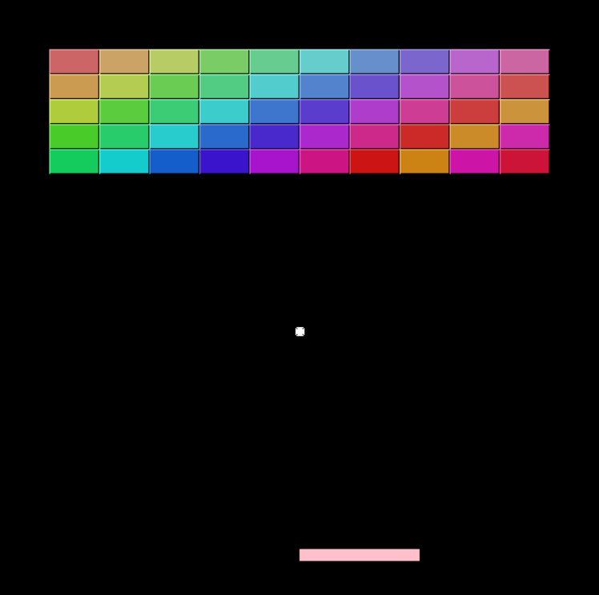

# Breakout

## About
Translated from the [pgzero examples version](https://github.com/lordmauve/pgzero/blob/master/examples/basic/breakout.py) It demonstrates circles, rects, movement, and more advanced collisions.

## Screenshot

## License
Uses the LGPL-3.0 License.
